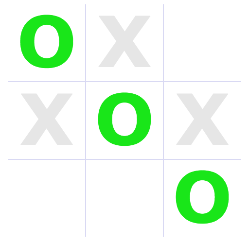
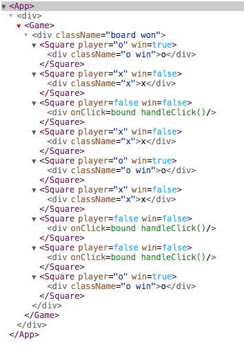

# Tic-Tac-Redux

We'll start with our app from last class, which can be found at [https://github.com/chasm/tic-tac-react](https://github.com/chasm/tic-tac-react). Be sure to clone a copy to use as the base from which to build today's application.

If, after you've cloned it, you'd like to make the repo your own, just delete the `.git` folder, then run `git init` to start your own repo:

```sh
rm -rf .git
git init
git add -A
git commit -m "Initial commit"
```

Once you've cloned the app, make sure you have `n` installed and the latest version of node, as well as `jspm` and the `jspm-server` installed globally. Oh, and it won't hurt to have some babel stuff installed globally as well. Then you can run `npm install` and `jspm install` to set up the app. Finally, running `jspm-server` will serve the app on localhost:8080. You can see and play the game there, and you can run the tests at [http:://localhost:8080/test.html](http:://localhost:8080/test.html)

```sh
npm i -g n
n latest
npm i -g jspm jspm-server babel babel-cli babel-node babel-preset-es2015 babel-preset-stage-0 babel-preset-react
npm install
jspm install
jspm-server
```

OK, we should be ready to go. Let's do a quick review.

In the `index.html` file we see the following script elements:

```html
<script src="jspm_packages/system.js"></script>
<script src="config.js"></script>
<script>
  System.import('app/main.jsx!')
</script>
```

The first one loads `system.js` from our local JSPM packages. [System.js](https://github.com/systemjs/systemjs) is:

> Universal dynamic module loader - loads ES6 modules, AMD, CommonJS and global scripts in the browser and NodeJS. Works with both Traceur and Babel.

The second script loads our local configuration file, which tells it what modules we're using and what options we've selected. The `config.js` file is handled automatically by JSPM. You don't need to worry about it.

Finally, we use System.js's `import` method it grab our top-level JavaScript file and begin resolving the import statements and loading up the various modules. In development mode it parses this tree each time the page is loaded, so it can be a little slow. In production, you would bundle everything up.

That leads us to our `app/main.jsx` file. To load this file properly as JSX, be sure you have the ! (bang) character after the extension. This tells the JSPM JSX transpiler to transpile the JSX to JS.

Our `main.jsx` file looks like this:

```jsx
// app/main.jsx
import React from 'react'
import ReactDOM from 'react-dom'

import App from './components/App.jsx!'

const main = () => {
  const app = document.createElement('div')

  document.body.appendChild(app)

  ReactDOM.render(<App/>, app)
}

main()
```

We import React, which gives us JSX. And we import the ReactDOM, which we need to manipulate the browser's DOM. Facebook says:

> The react-dom package provides DOM-specific methods that can be used at the top level of your app and as an escape hatch to get outside of the React model if you need to. Most of your components should not need to use this module.

And indeed we'll only use it in the `main.jsx` file to render our App to the browser. Here we create a new `<div/>` element, append it to the `<body>`, and then render our App into it. That's all our `main.jsx` file does.

You'll note that we also import our App from `./components/App.jsx!` (note the !).

Our `app.jsx` file looks like this:

```jsx
// app/components/app.jsx
import React, { Component } from 'react'

import Game from './game.jsx!'

class App extends Component {

  render () {
    return <div>
      <Game/>
    </div>
  }
}

export default App
```

Note that we didn't need to import ReactDOM here, just React. We're going to create our component class by inheriting from the React Component class, so we import that individualy using destructured assignment (new in JavaScript 2015). That means we don't have to write `extends React.Component`. Your mileage may vary. Do it whichever way works for you.

We're going to need the Game component, so we import that. Note the ! to transpile it. Don't forget that.

Our component is very simple (so far). We simply render a `<div>` element wrapped around our `<Game/>` component. Note that empty elements must have a `/` before the closing `>`. Also, while the `<div>` element is a JSX component as well, it represents a typical HTML div element. All the usual HTML elements are available.

The `game.jsx` file is where it all happens, currently. We begin by importing React and Component, and then we import a whole lotta Ramda functions. I like Ramda! So sue me. Finally, we import our Square component, which we'll use to build the board.

```jsx
// in app/components/game.jsx
import React, { Component } from 'react'

import {
  addIndex,
  append,
  contains,
  curry,
  filter,
  flatten,
  indexOf,
  isEmpty,
  map,
  reduce,
  repeat,
  update
} from 'ramda'

import Square from './square.jsx!'
```

Then we add the index to the Ramda `map` function so we can map with indexing in our `render` method. Did I mention that I love Ramda? We also set up our "win patterns" which we'll use to determine if a player has won the game. I'm using the `const` keyword here because we won't be reassigning these variables.

```jsx
// in app/components/game.jsx
const mapIndexed = addIndex(map)

const winPatterns = [
  [0, 1, 2],
  [3, 4, 5],
  [6, 7, 8],
  [0, 3, 6],
  [1, 4, 7],
  [2, 5, 8],
  [0, 4, 8],
  [2, 4, 6]
]
```

Then we create our Game class, inheriting from React's Component class. The `constructor` runs automatically when the Game class is instantiated. Here, it passes the props up to the superclass (Component), and then sets up our state. The Game class is currently the only component in which we maintain state for our application. In general, we want to concentrate all our state in one place so we can keep a close eye on it. State is not to be trusted! We'll keep it chained up here.

Our state has been kept as simple as possible. We just track a history of moves as an array (list) of square indices (from 0 to 8). These refer to the positions on the board. Because X always moves first, we know that the even-numbered positions in our history array (0, 2, 4, etc.) are X moves, and the odd positions (1, 3, 5, etc.) are O moves.

So from this simple array we can determine everything we need to know about the state of the game.

```jsx
// in app/components/game.jsx
class Game extends Component {

  constructor (props) {
    super(props)

    this.state = { history: [] }
  }

  // more code . . .
}
```

Let's work our way through the code. We'll start with the `render` method at the bottom because, after all, that's what the component does that's worth mentioning, right?

```jsx
// in app/components/game.jsx
render () {
  const board  = this.getBoard(this.state.history)
  const wins   = flatten(this.checkForWin(board))
  const inPlay = isEmpty(wins)
  const status = inPlay ? 'board' : 'board won'

  return <div className={status}>
    {this.renderBoard(board, wins)}
  </div>
}
```

The first thing we do is call `this.getBoard` and pass it the history array from our state. This means that every time the history changes, our Game will call `render` again. Here's the `getBoard` method:

```jsx
// in app/components/game.jsx
getBoard (history) {
  const move = curry(this.makeMove.bind(this))
  const memo = repeat(false, 9)

  return reduce(move(history), memo, history)
}
```

This is the tricky part. The `getBoard` method is going to use the Ramda `reduce` function to loop through the history array and "reduce" (or "fold") it into a board array. The way this works is that we pass in an empty board, which is to say an array of 9 `false` values representing the 9 squares on the board. They are false because they have not yet been played. This is the "memo" which will act as our accumulator, accumulating the actual moves until we have a completed board (for our current state). The Ramda `repeat` function is used to create the array.

The `reduce` method takes a function of two parameters&mdash;the "accumulator" (memo) and the value passed in from the history array. We're going to need to figure out which player is playing (based on position in the history array) and then return a new copy of the `memo` array with that player's mark in the appropriate square.

To do this, we've created a `makeMove` method:

```jsx
// in app/components/game.jsx
makeMove (history, memo, move) {
  const player = this.getPlayer(move, history)

  return update(move, player, memo)
}
```

It takes our accumulator (memo) and our move (from the history array), but, uh, whoops! We also need the full history array so we can figure out which player is playing. Ramda's `reduce` expects two parameters, but here we have three. Hmm.

If you look back up to the `getBoard` method, you'll see that we're doing something clever with Ramda's `curry` function. We've created a new function called `move` by wrapping our `makeMove` method in `curry`. What does this do?

To curry a function means to split the parameters so that they can be applied one at a time. If I have, say, three parameters, I can call the function with the first parameter only, and it will return a *function* that takes the remaining two parameters (and so on).

So in our `getBoard` method, when we call `reduce` instead of giving it the `makeMove` method directly, we call the curried method *with our history array* which *partially applies* the `makeMove` method. Now our history is captured in the method and we can use it to calculate the player.

Speaking of which, let's look at the `makeMove` method a bit more closely. The first thing we do is use that captured `history` array and the move to call the `getPlayer` method. That method looks like this:

```jsx
// in app/components/game.jsx
getPlayer (move, history) {
  return (indexOf(move, history) % 2 === 0) ? 'x' : 'o'
}
```

It should be obvious what this one does. It uses Ramda's `indexOf` method to figure out where in the history array the move occurs, and it returns that index. We use modulus to get the remainder when divided by 2. If the remainder is 0, then it's an even-numbered index and the player is 'x'. If the remainder is 1, then the player is 'o'. Easy peasy.

Back in the `makeMove` method, we user Ramda's `update` function to create a new copy of `memo` with the `move` index updated to `player`. In other words:

```
Calling update with
move === 4
player === 'x'
memo === [false, false, false, false, false, false, false, false, false]

Returns [false, false, false, false, 'x', false, false, false, false]
```

Got it? This repeats with 3, 0, etc. until the history array is exhausted. If our history array was `[4, 3, 0, 8, 2, 1, 6]`, then the output of `getBoard` would be:

```js
[ 'x', 'o', 'x', 'o', 'x', false, 'x', false, 'o' ]
```

That brings us back to our `render` method:

```jsx
// in app/components/game.jsx
render () {
  const board  = this.getBoard(this.state.history)
  const wins   = flatten(this.checkForWin(board))
  const inPlay = isEmpty(wins)
  const status = inPlay ? 'board' : 'board won'

  return <div className={status}>
    {this.renderBoard(board, wins)}
  </div>
}
```

Next we're going to call `checkForWin` and pass it our newly created board.

```jsx
// in app/components/game.jsx
checkForWin (board) {
  return filter((pattern) => {
    var s1 = board[pattern[0]]
    var s2 = board[pattern[1]]
    var s3 = board[pattern[2]]

    return s1 && s1 === s2 && s2 === s3
  }, winPatterns);
}
```

This takes our array of win patterns (each an array of three square numbers) and loops through it using Ramda's `filter` function. The `filter` function loops through a collection and returns a new collection including only those items for which the passed in anonymous function returned `true`.

So our anonymous function takes each win pattern one at a time and check the board to see if the three cells in the pattern all have the same player's mark in them. If they do, then that pattern is returned.

If there's no winner, the `checkForWin` method returns an empty array, `[]`. If there is a win, it returns one or more winning patterns, e.g., `[[0, 4, 8], [2, 4, 6]]`. OK, almost always, there will only be one pattern.

Nevertheless, our `render` method uses Ramda's `flatten` function to flatten the array, e.g., `[[0, 4, 8], [2, 4, 6]]` becomes [0, 2, 4, 6, 8]. These will be used to color those squares with the winning player's color while the non-winning squares are grayed out.

Continuing, if the `wins` array is empty, then the game is still "inPlay". We set the `className` on our board accordingly. Then we hand off creation of the actual board HTML to the `renderBoard` method, which looks like this:

```jsx
// in app/components/game.jsx
renderBoard (board, wins) {
  const inPlay = isEmpty(wins)

  return mapIndexed((player, idx) => {
    if (inPlay) {
      if (player) {
        return <Square key={idx} player={player}/>
      } else {
        return <Square key={idx} clickCb={this.handleClick.bind(this, idx)}/>
      }
    } else {
      return <Square key={idx} player={player} win={contains(idx, wins)}/>
    }
  }, board)
}
```

This should be pretty obvious. We map through the board, adding the appropriate squares to our output array.

If the game is in play and the square has been played, then we render it like this, e.g.:

```jsx
<Square key={4} player={'x'}/>
```

If it's in play but unplayed, we render it thus, e.g.:

```jsx
<Square key={6} clickCb={this.handleClick.bind(this, 6)}/>
```

So the click callback is only attached when the square is in play but unplayed. Note that we cleverly bind the index of the square to the click callback so the square can remain blissfully ignorant of it's place in the bigger picture. Did we mention that this is clever? Very clever.

Finally, if the game is won, we return a square like this, e.g.:

```jsx
<Square key={2} player={'x'} win={true}/>
```

That `win` prop is determined by comparing the index of the square to the numbers in the `wins` array. Given the `wins` array above and square 2, we get `contains(2, [0, 2, 4, 6, 8])`, which clearly returns `true`.

But wait! What is this `handleClick` method that we're passing to the Square and binding to the Square's index?

```jsx
// in app/components/game.jsx
handleClick (square) {
  this.setState({ history: append(square, this.state.history) })
}
```

Here we see how state is changed in a React component. *We never set state directly!* We're always going to use the `setState` setter, passing it the part of the state we want to update (this is merged into the state to create a new state).

Here we use Ramda's `append` function to append our square's number to the current history array, and then we set that as the new history array.

How does the square handle this? Glad you asked. Here is the Square code:

```jsx
// app/components/square.jsx
import React, { Component } from 'react'

class Square extends Component {

  handleClick (event) {
    if (this.props.clickCb) {
      this.props.clickCb()
    }
  }

  render () {
    const winner = !!this.props.win
    const player = this.props.player

    const status = winner ? `${player} win` : player

    return !!player ?
      <div className={status}>{player}</div> :
      <div onClick={this.handleClick.bind(this)}/>
  }
}

export default Square
```

The import and export should be clear by now. Yep, we extend the React Component class to give us our Square. Yep, we override the Component's `render` method with our own. Here we set `winner` and `player` values just to make the remaining code clearer. They are simply the `props` passed in from the Game component, available through `this.props.<propName>`.

Then we use the status of `this.props.win` (true or undefined) to set `winner` to true or false and then we use that in a ternary operator to decide whether to add the "win" class. If the square has been played (player is not undefined), we return, for example:

```jsx
<div class="x">x</div>
```

Or, if the game was won by x and this is one of the winning squares,

```jsx
<div class="x win">x</div>
```

If the square is unplayed, then we return an empty div with a click event handler:

```jsx
<div onclick="this.handleClick"></div>
```

If the square is clicked on, the Square's `handleClick` method is called:

```jsx
// in app/components/square.jsx
handleClick (event) {
  if (this.props.clickCb) {
    this.props.clickCb()
  }
}
```

And all it does is call the Game's `handleClick` method, bound with the number of the Square, and passed in via `this.props.clickCb`.

Everything making sense now?

So if we have a win like this:



Then we have React like this (from the [React Developer Tools](https://chrome.google.com/webstore/detail/react-developer-tools/fmkadmapgofadopljbjfkapdkoienihi) in Chrome&mdash;and there's a [Firefox version](https://addons.mozilla.org/en-US/firefox/addon/react-devtools/), too).



And our HTML output in the DOM looks like this:

```html
<div data-reactid=".0">
  <div class="board won" data-reactid=".0.0">
    <div data-reactid=".0.0.$0" class="o win">o</div>
    <div data-reactid=".0.0.$1" class="x">x</div>
    <div data-reactid=".0.0.$2"></div>
    <div data-reactid=".0.0.$3" class="x">x</div>
    <div data-reactid=".0.0.$4" class="o win">o</div>
    <div data-reactid=".0.0.$5" class="x">x</div>
    <div data-reactid=".0.0.$6"></div>
    <div data-reactid=".0.0.$7"></div>
    <div data-reactid=".0.0.$8" class="o win">o</div>
  </div>
</div>
```


